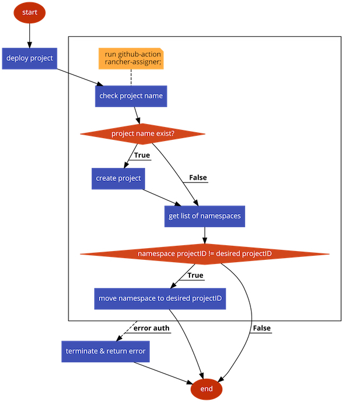

# rancher-ns-mover

This github action will move kubernetes namespace location in a specific rancher project in a certain cluster.

## Flowchart



## Usage

```yaml
steps:
- name: Configure namespace-project mapping in rancher
  uses: kitabisa/actions/rancher-ns-mover@master
  with:
    rancher-host: 'https://www.rancher.host'
    rancher-access-key: 'your-access-key'
    rancher-secret-key: 'your-secret-key'
    cluster-id: 'your-cluster-id'
    project-name: 'your-project'
    namespace: 'your-namespace'

```

## Parameters

See [action.yml](action.yml)

| Name                      | Description                                | Required/Optional      |
| ------------------------- | -------------------------------------------| ---------------------- |
| `rancher-host`            | Rancher host address                       | required               |
| `rancher-access-key`      | Auth user access key                       | required               |
| `rancher-secret-key`      | Auth user secret key                       | required               |
| `cluster-id`              | Rancher cluster ID                         | required               |
| `project-name`            | Project name defined in Rancher cluster    | required               |
| `namespace`               | Kubernetes namespace                       | required               |

# License

The scripts and documentation in this project are released under the [Apache 2.0 License](LICENSE)
